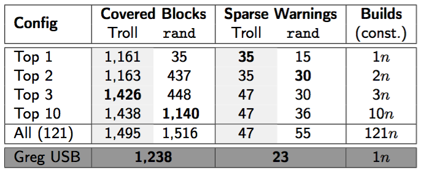

# Troll

**Troll** is a tool written in C++ with the main purpose of merging a specified set of Kconfig configurations to a smaller set of configurations potentially enabling more options and hence more code for further tests and (static) analysis.

<p align="center">

</p>

# Background: Configurations for Software Testing

Testing software at scale of Linux has many faces.  There are static checks, for instance with [Coccinelle](http://coccinelle.lip6.fr/), build tests, boot tests, run-time and performance tests, fuzzing and many more.  In nearly all cases, we need a kernel config in order to build Linux.  Recent Linux kernels ship nearly 16,000 configuration options, so when it comes to testing we want to make sure that we test as many variants of our code (i.e., different configs) as possible.

Testing systematically as many variants or configurations of our code as possible is crucial for the efficiency for software testing -- blindly testing code is a huge waste resources.  However, generating a set of configurations for a given set of source files, such as drivers, subsystems, or entire architectures, is non-trivial.  Firstly, configuring Linux is complex and tiresome.  Which of those thousands of options is relevant for our use-case?  Second, the constraints among those options are spread over Kconfig files, build-system files and even in #ifdef blocks in the source code.  Thus, manually generating configurations that reach a satisfying coverage in terms of variants is impossible.

The developers of Troll looked at the state-of-the-art in the Linux and the research community how to tackle the problem of finding configurations for testing, and found space for improvement.  The main issue is that approaches from the Linux community scale, but are not systematic, while research approaches are systematic but do not scale.  Same old story, right?  In the following, we briefly discuss those approaches and explain why Troll can help to improve the state-of-the-art of generating configurations for testing.

## Linux Community

The Linux community has in general two ways to deal with configurations for testing:

1. Maintaining a pre-defined set of configurations
    * Developers, maintainers and continuous-integration frameworks, for instance [Kernel CI](https://kernelci.org/) or Intel's [0-Day infrastructure](https://01.org/lkp/) have a set of configs depending on the drivers, subsystem, architecture, etc. that is subject of testing.  Such configs are known to work well for testing huge parts of the system.  However, the configs need to be maintained and evolved as the variability model (i.e., Kconfig, Kbuild, #ifdefs, etc) evolves as well.

2. Using ```$ make randconfig```
    * ```randconfig``` assigns random values to most configuration options, depending on the selected architecture (e.g., ARM, X86_64).  Such random configs are widely used in continuous integrations and have proven to detect a huge amount of bugs -- just browse [Linux mailing lists](http://vger.kernel.org/vger-lists.html).


Both approaches (1) and (2) are the main approaches of the Linux community to deal with the problem of finding/generating a set of configs for testing.  Both approaches are *not* systematic at all, since when using (1) we rely on the quality of a limited set of configs.  When using (2) we cannot even be sure if any part of the code we are interested in will be compiled.  The Troll developers believe that a more systematic approach to generate configs for a given driver, subsystem, etc. can greatly improve the efficiency of today's testing frameworks.

## Research Community

The main approach of the research community to tackle the problem of generating a set of configs that cover as many variants of our code as possible is *sampling*.  Research tools, for instance [**Undertaker**](https://undertaker.cs.fau.de), take one source file as input, parse the structure and conditions of #ifdef blocks and transform it into a propositional formula along with constraints from Kconfig and the build system and generate a set of configurations that enable as many #ifdef blocks as possible.  The amount and quality of the generated configs depend on the underlying algorithms.  Medeiros et al. published a nice [paper](http://arxiv.org/abs/1602.02052) on ICSE 2016 comparing 10 sampling algorithms and discuss the quality and scalability of such in great detail.  The Troll developers identified various issues in the state-of-the-art of those research tools:

1. Most algorithms do not scale well, especially when considering constraints from Kconfig and the build system.  Troll developers currently use Undertaker's statement-coverage algorithm, which is known to scale well (see [USENIX 2014 paper](https://www4.cs.fau.de/Publications/2014/tartler_14_usenix.pdf)); other algorithms yield better results, but do not scale as well as statement-coverage.

2. *All* algorithms work only locally (i.e., on a file basis).  Undertaker takes one file as input and generates configs for exactly this file.  Hence if we want to generate configs for 1,000 source files we receive 1,000+ configs, each of them exploring the variability space of one file.

The main issue with the current state-of-the-art in the research community considering generating configs for testing is that the generated configs relate to one file only.  Hence we have many configs that enable a small portion of the kernel.  We want few configs that enable as many variants as possible; it is unacceptable and maybe impossible to build 1000k+ highly redundant configs.

### Merging Configurations

The idea behind **Troll** is to use state-of-the-art sampling tools from research.   The implemented algorithms  are very systematic in the sense of sampling the variability space of the source code while using constraints from Kconfig and the build system.  Since the generated configurations are highly redundant, Troll tries to minimize the amount of configs by merging configs that do not conflict (i.e., a common option with differently assigned values).

Thanks to the [PMC](https://www.cs.purdue.edu/homes/dgleich/codes/maxcliques/) maximum-clique finder, Troll scales surprisingly well (NP completeness) and merges over 30k x86 Linux kernel configurations in around 3 minutes on an average work station with a core i7 and 16GiB of RAM.

# The Troll How-To

Here's a rather verbose step-by-step guide how to use Troll in the Linux kernel.

Let's assume we are a Linux USB developer; we integrated a bunch of changes and now want to do some build tests before issuing run-time tests.  Instead of using a pre-defined set of configs which are likely not to cover newly integrated code, we can use Undertaker to generate a set of configurations that Troll merges afterwards.  Note that configs generated by Undertaker are also known as **partial configurations**, since only such config options that are relevant to enable the #ifdef blocks in the respective source files are considered.  Those configs will not compile unless being *expanded*, for instance via ```$ KCONFIG_ALLCONFIG=/path/to/partial/config make allyesconfig ```.


## Step 1: Finding a Set of Files

Let's first get a set of files of our interest, and remember, we are USB developer:

``` $ find drivers/usb include/linux/usb/ -name "*.[cSsh]" > usb.batch ```

``` $ echo "include/linux/usb.h" >> usb.batch ```


## Step 2: Generating Partial Configurations

Generating partial configurations is the backbone of Troll.  No configurations, nothing to 'troll'.  As shown by [Medeiros et al](http://arxiv.org/pdf/1602.02052v3.pdf), there are various (combinations) of so called sampling algorithms (i.e., algorithms generating partial configurations).  For our purpose, we use the statement-coverage algorithm implemented in [Undertaker](https://undertaker.cs.fau.de) entailing several advantages.  First, statement coverage shows good scalability and since we need to get work done, scaling is a good thing.  Second, Undertaker ships an entire suite of different tools that, among other things, allows us to extract variability information (i.e., variability models) from the configuration system Kconfig and also the build system of Linux.  Having variability information at hand, such as the constraints among features, is a prerequisite to merge partial configurations.  Without such information, we could generate invalid configurations (i.e., invalid combinations of configuration options) since we would ignore the relationships (i.e., constraints) among them.

After downloading and installing [Undertaker](https://undertaker.cs.fau.de) (there are some Debian/Ubuntu packages as well), we can start extracting the variability models. Let's assume that we only care about the x86 architecture:

``` $ undertaker-kconfigdump x86 ```

Now the more interesting part starts -- generating partial configurations -- which we do by using the previously generated batch file *usb.batch*.  Since Troll also requires a batch file specifying the partial configs of interested, we collect them right after generation.

``` $ undertaker -j coverage -m models/x86.model -t#CPUs -b usb.batch ```

``` $ find drivers/usb/ -name "*.config[0-9]*" > usb.configs ```


## Step 3: Merging Partial Configurations

Reaching this step, we 'sampled' all files of our interested and generated a set of partial configurations.  *Without* Troll, the only thing we can do with those configs is to use them on their corresponding files in order to do *local* analysis only.  Such file local analysis are well understood despite the fact that headers are not included due to the exponential explosion of potential combinations of configuration options.  Linux files tend to include more than 250 headers on average, which is a serious threat to scalability and feasibility for sampling algorithms in general, but that's another story.  *With* Troll, we can elevate the local analysis to a *global* analysis, since we gather the variability information from source files of our interested, and aggregate them into a small(er) set of partial configurations.

To merge the previously generated partial configurations, we give Troll the corresponding batch file:

``` $ troll -b usb.configs -t#CPUs ```

As soon as Troll has finished, we can find a set of new *partial* configurations in our working directory in the following format *troll.config.**ID**.**SIZE**.* Those merged configurations are consecutively numbered (ID) and also indicate how many previous configurations have been merged (SIZE) -- lower IDs usually indicate bigger SIZEs.

Now we have a bunch of merged partial configurations that we can use for further (static) analysis, build tests, boot tests, run-time tests, etc.  In our experience, Troll generates a small amount of configs with high sizes, and many configs with small sizes (usually of size 1).


## Step 4: Results and Evaluation

At this point we used **Troll** to merge previously generated partial configurations in order to reduce the amount of configurations we have to consider for testing.  If we take the use-case above on Linux v4.5 we can merge 776 partial configs to 121  Troll'ed configs, and thereby reduce the amount of configs by around 85%.  This doesn't seem to impress at first sight, but notice that 77 of 121 Troll'ed configs have cardinality 1 (i.e., they could not be merged with another config).  Let's see how good those Troll'ed configs are.

To evaluate our configs we use two metrics:

1. **Configuration coverage**: in other words the amount of #ifdef blocks being compiled by a config.  There is some handy scripts shipped with Troll to do such analysis.

2. Amount of **GCC warnings**: it's a widely used metric to compare the quality/coverage of configs.

In the following table, we compare three kinds of configs.  We compare our 121 Troll'ed configs with 121 randconfigs.  A huge **thank you** to *Greg Kroah-Hartman* (USB maintainer among many other things) for kindly sharing the Kernel config he uses to build test USB related code, which we take as a baseline.  The table compares the **Top n** configs from Troll and randconfig.  Note that the Troll Top n are sorted w.r.t. their IDs, randconfigs are sorted w.r.t. to the amount of config options being either set to 'y' or 'm' -- the hypothesis is that the more options are enabled the higher coverage is.

We can see that Troll'ed configs instantly outperform the baseline with the first config, and show considerable improvements with the Top 3 configs.  Although randconfig yields more GCC warnings at Top 2 than baseline, it can only beat Troll'ed configs when considering all configurations.

In this scenario, Troll shows promising results, especially when considering that entire process from building the models, sampling the USB source files and merging the partial configurations takes **less than 30 seconds**.  An evaluation in greater detail will be released in a follow-up paper.

**Happy Troll'ing!**

<p align="center">

</p>
